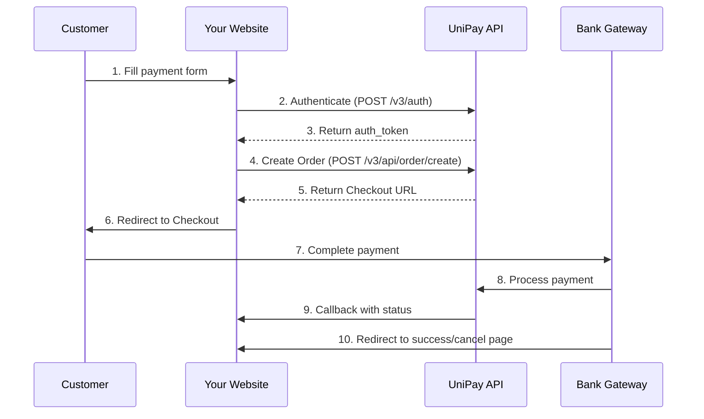

# UniPay Payment Integration Guide

## Table of Contents
1. [Overview](#overview)
2. [Prerequisites](#prerequisites)
3. [Environment Setup](#environment-setup)
4. [API Flow Diagram](#api-flow-diagram)
5. [Implementation Details](#implementation-details)
6. [API Endpoints](#api-endpoints)
7. [Testing](#testing)
8. [Troubleshooting](#troubleshooting)
9. [Security Considerations](#security-considerations)
10. [Production Checklist](#production-checklist)

---

## Overview

UniPay is a Georgian payment gateway that enables online payments through local banks (Bank of Georgia, TBC Bank, etc.). This integration allows accepting payments in Georgian Lari (GEL) from customers using Georgian bank cards.

### Key Features
- Secure payment processing through Bank of Georgia's MPI gateway
- Support for Georgian Lari (GEL) transactions
- Real-time payment status callbacks
- Test and production environments

### Integration Architecture
```
Customer → Your Website → UniPay API → Bank of Georgia → Payment Complete
```

---

## Prerequisites

### Required Credentials
You'll need the following from UniPay:
- **Merchant ID**: A 13-digit identifier (e.g., `5000000000000`)
- **API Key**: A UUID format key (e.g., `xxxxxxxx-xxxx-xxxx-xxxx-xxxxxxxxxxxx`)

### Important Notes
- Credentials are provided by UniPay after merchant registration
- **Test credentials will NOT work for order creation** - you need production credentials
- Contact UniPay support to enable API access for your merchant account

---

## Environment Setup

### 1. Environment Variables

Store these securely in your deployment platform (Vercel, Heroku, etc.):

```bash
UNIPAY_MERCHANT_ID=your_merchant_id_here
UNIPAY_API_KEY=your_api_key_here
```

**⚠️ NEVER commit these to Git or expose them in client-side code!**

### 2. Required Dependencies

```json
{
  "dependencies": {
    "axios": "^1.11.0"
  }
}
```

---

## API Flow Diagram



---

## Implementation Details

### Step 1: Authentication

**Endpoint**: `https://apiv2.unipay.com/v3/auth`  
**Method**: POST  
**Headers**: 
```javascript
{
  'Accept': 'application/json',
  'Content-Type': 'application/json'
}
```

**Request Body**:
```javascript
{
  "merchant_id": "YOUR_MERCHANT_ID",
  "api_key": "YOUR_API_KEY"
}
```

**Response**:
```javascript
{
  "auth_token": "LoHYClEOMTPT21b54HJD3cjN...", // Long token string
  "token_type": "Bearer",
  "expires_in": 1800  // Token expires in 30 minutes
}
```

**⚠️ Important**: The token field is `auth_token`, NOT `access_token`!

### Step 2: Create Payment Order

**Endpoint**: `https://apiv2.unipay.com/v3/api/order/create`  
**Method**: POST  
**Headers**:
```javascript
{
  'Authorization': `Bearer ${auth_token}`,  // From Step 1
  'Accept': 'application/json',
  'Content-Type': 'application/json'
}
```

**Request Body**:
```javascript
{
  "MerchantUser": "customer@email.com",        // Customer email
  "MerchantOrderID": "UNIQUE-ORDER-123",       // Your unique order ID
  "OrderPrice": 10.00,                         // Amount in GEL
  "OrderCurrency": "GEL",                      // Always "GEL" for Georgian Lari
  "OrderName": "Product Name",                 // Product/service name
  "OrderDescription": "Order description",     // Brief description
  "SuccessRedirectUrl": "base64_encoded_url",  // Where to redirect on success
  "CancelRedirectUrl": "base64_encoded_url",   // Where to redirect on cancel
  "CallBackUrl": "base64_encoded_url"          // Your webhook endpoint
}
```

**⚠️ Important**: All URLs MUST be base64 encoded!

**Example URL Encoding**:
```javascript
const successUrl = Buffer.from("https://yoursite.com/payment-success").toString('base64');
// Result: "aHR0cHM6Ly95b3Vyc2l0ZS5jb20vcGF5bWVudC1zdWNjZXNz"
```

**Response**:
```javascript
{
  "errorcode": 0,
  "message": "OK",
  "data": {
    "Checkout": "https://mpi.gc.ge/unipay3/?lang_code=ka&merch_id=...",
    "UnipayOrderHashID": "MP501715868A6D9FE96BF4",
    "UnipayOrderID": 5786508
  }
}
```

### Step 3: Redirect to Payment

After receiving the checkout URL, redirect the customer:

```javascript
window.location.href = response.data.data.Checkout;
```

The customer will:
1. Be redirected to Bank of Georgia's secure payment page
2. Enter their card details
3. Complete 3D Secure verification if required
4. Be redirected back to your success or cancel URL

---

## API Endpoints

### Complete Working Example (Node.js/Vercel)

```javascript
const axios = require('axios');

// UniPay API endpoints
const UNIPAY_AUTH_URL = 'https://apiv2.unipay.com/v3/auth';
const UNIPAY_ORDER_URL = 'https://apiv2.unipay.com/v3/api/order/create';

// Helper function to encode URLs to base64
function encodeBase64(str) {
    return Buffer.from(str).toString('base64');
}

// Generate unique order ID
function generateOrderId() {
    const timestamp = Date.now();
    const random = Math.random().toString(36).substring(2, 9).toUpperCase();
    return `ORDER-${timestamp}-${random}`;
}

async function createPayment(email, name, amount, productName) {
    try {
        // Step 1: Authenticate
        const authResponse = await axios.post(UNIPAY_AUTH_URL, {
            merchant_id: process.env.UNIPAY_MERCHANT_ID,
            api_key: process.env.UNIPAY_API_KEY
        }, {
            headers: {
                'Accept': 'application/json',
                'Content-Type': 'application/json'
            }
        });
        
        // IMPORTANT: Token is in auth_token field, not access_token!
        const accessToken = authResponse.data.auth_token;
        
        // Step 2: Create Order
        const orderId = generateOrderId();
        const baseUrl = 'https://yoursite.com';
        
        const orderData = {
            MerchantUser: email,
            MerchantOrderID: orderId,
            OrderPrice: parseFloat(amount),
            OrderCurrency: "GEL",
            OrderName: productName,
            OrderDescription: `Payment from ${name}`,
            SuccessRedirectUrl: encodeBase64(`${baseUrl}/payment-success?order=${orderId}`),
            CancelRedirectUrl: encodeBase64(`${baseUrl}/payment-cancel?order=${orderId}`),
            CallBackUrl: encodeBase64(`${baseUrl}/api/unipay/callback`)
        };
        
        const orderResponse = await axios.post(UNIPAY_ORDER_URL, orderData, {
            headers: {
                'Authorization': `Bearer ${accessToken}`,
                'Accept': 'application/json',
                'Content-Type': 'application/json'
            }
        });
        
        // Check for errors
        if (orderResponse.data.errorcode && orderResponse.data.errorcode !== 0) {
            throw new Error(`UniPay error: ${orderResponse.data.message}`);
        }
        
        // Extract checkout URL
        const paymentUrl = orderResponse.data.data?.Checkout;
        
        if (!paymentUrl) {
            throw new Error('No payment URL returned from UniPay');
        }
        
        return {
            success: true,
            orderId: orderId,
            paymentUrl: paymentUrl,
            unipayOrderId: orderResponse.data.data?.UnipayOrderID,
            unipayOrderHashId: orderResponse.data.data?.UnipayOrderHashID
        };
        
    } catch (error) {
        console.error('Payment error:', error.response?.data || error.message);
        throw error;
    }
}
```

### Callback Handler

UniPay will send payment status updates to your callback URL:

```javascript
// api/unipay/callback.js
module.exports = async (req, res) => {
    if (req.method === 'POST') {
        const {
            OrderHashID,
            MerchantOrderID,
            Status,
            PaymentStatus,
            Amount,
            Currency,
            PaymentMethod,
            TransactionID
        } = req.body;
        
        console.log('Payment callback received:', {
            OrderHashID,
            MerchantOrderID,
            Status,
            PaymentStatus,
            Amount
        });
        
        // TODO: Update your database with payment status
        // TODO: Send confirmation email to customer
        // TODO: Update inventory, activate services, etc.
        
        return res.status(200).json({
            success: true,
            message: 'Callback received'
        });
    }
    
    return res.status(405).json({ error: 'Method not allowed' });
};
```

---

## Testing

### Test Checklist

1. **Environment Variables**
   ```bash
   # Verify credentials are set
   echo $UNIPAY_MERCHANT_ID  # Should show your merchant ID
   echo $UNIPAY_API_KEY      # Should show your API key
   ```

2. **Test Authentication**
   ```bash
   curl -X POST https://apiv2.unipay.com/v3/auth \
     -H "Content-Type: application/json" \
     -d '{
       "merchant_id": "YOUR_MERCHANT_ID",
       "api_key": "YOUR_API_KEY"
     }'
   ```
   
   Should return an `auth_token`.

3. **Test Order Creation**
   - Use your test page to create an order
   - Verify you receive a checkout URL
   - Confirm the URL starts with `https://mpi.gc.ge/unipay3/`

4. **Test Payment Flow**
   - Complete a test payment with a real card (small amount)
   - Verify redirect to success page
   - Check callback is received

### Common Test Card Numbers
⚠️ **Note**: UniPay doesn't provide test cards. You must use real cards for testing with small amounts.

---

## Troubleshooting

### Common Issues and Solutions

| Error | Cause | Solution |
|-------|-------|----------|
| `403: Invalid ability provided` | Account not activated | Contact UniPay to enable API access |
| `401: Not Authenticated` | Wrong token format | Use `Bearer ${token}` format |
| No `auth_token` in response | Using test credentials | Use production credentials |
| `404` on API calls | Wrong endpoint URL | Check you're using `apiv2.unipay.com` |
| Redirect URLs not working | URLs not base64 encoded | Encode all URLs with Buffer.from().toString('base64') |
| No callback received | Callback URL not accessible | Ensure your callback endpoint is publicly accessible |

### Debug Endpoints

Create these endpoints for debugging:

```javascript
// Check if credentials are loaded
app.get('/api/unipay/test-config', (req, res) => {
    res.json({
        hasMerchantId: !!process.env.UNIPAY_MERCHANT_ID,
        hasApiKey: !!process.env.UNIPAY_API_KEY,
        merchantIdLength: process.env.UNIPAY_MERCHANT_ID?.length,
        merchantIdPrefix: process.env.UNIPAY_MERCHANT_ID?.substring(0, 4) + '***'
    });
});
```

---

## Security Considerations

### 1. Credential Security
- **NEVER** hardcode credentials in source code
- **NEVER** expose credentials to client-side JavaScript
- **ALWAYS** use environment variables
- **ROTATE** API keys periodically

### 2. CORS Configuration
```javascript
// Only allow your domains
const allowedOrigins = [
    'https://yourdomain.com',
    'https://www.yourdomain.com'
];

if (allowedOrigins.includes(req.headers.origin)) {
    res.setHeader('Access-Control-Allow-Origin', req.headers.origin);
}
```

### 3. Input Validation
```javascript
// Validate amount
if (amount <= 0 || amount > 10000) {
    throw new Error('Invalid amount');
}

// Validate email
const emailRegex = /^[^\s@]+@[^\s@]+\.[^\s@]+$/;
if (!emailRegex.test(email)) {
    throw new Error('Invalid email');
}

// Sanitize order ID (remove special characters)
const orderId = generateOrderId().replace(/[^a-zA-Z0-9-]/g, '');
```

### 4. Rate Limiting
Implement rate limiting to prevent abuse:
```javascript
const rateLimit = require('express-rate-limit');

const limiter = rateLimit({
    windowMs: 15 * 60 * 1000, // 15 minutes
    max: 10 // limit each IP to 10 requests per windowMs
});

app.use('/api/unipay/create-order', limiter);
```

### 5. Webhook Security
Verify callbacks are from UniPay:
- Check the source IP matches UniPay's servers
- Implement webhook signature verification if provided
- Use HTTPS only for callback URLs

---

## Production Checklist

Before going live, ensure:

### Configuration
- [ ] Production credentials are set in environment variables
- [ ] All test code and endpoints are removed
- [ ] Error messages don't expose sensitive information
- [ ] Logging is configured (but doesn't log sensitive data)

### Security
- [ ] HTTPS is enforced on all endpoints
- [ ] CORS is properly configured
- [ ] Rate limiting is implemented
- [ ] Input validation is comprehensive
- [ ] SQL injection protection (if using database)

### Testing
- [ ] Complete payment flow tested with real card
- [ ] Success page displays correctly
- [ ] Cancel/failure handling works
- [ ] Callbacks are processed correctly
- [ ] Email notifications work (if implemented)

### Monitoring
- [ ] Error tracking is set up (Sentry, LogRocket, etc.)
- [ ] Payment success/failure metrics are tracked
- [ ] Alerts configured for payment failures
- [ ] Regular monitoring of API response times

### Documentation
- [ ] API documentation is complete
- [ ] Customer support knows the payment flow
- [ ] Refund process is documented
- [ ] Troubleshooting guide is available

### Legal/Compliance
- [ ] Terms of service updated
- [ ] Privacy policy includes payment processing
- [ ] Refund policy is clear
- [ ] PCI compliance requirements met

---

## Support Contacts

### UniPay Support
- **Email**: [Contact through their website]
- **Phone**: [Provided after registration]
- **Technical Documentation**: https://apiv2.unipay.com/docs (if available)

### Integration Issues
When contacting support, provide:
1. Your Merchant ID
2. Order ID and timestamp of failed transaction
3. Error messages received
4. API request/response logs (without sensitive data)

---

## Appendix: Full HTML Payment Form Example

```html
<!DOCTYPE html>
<html lang="ka">
<head>
    <meta charset="UTF-8">
    <meta name="viewport" content="width=device-width, initial-scale=1.0">
    <title>Payment Form</title>
</head>
<body>
    <form id="paymentForm">
        <h2>გადახდის ფორმა</h2>
        
        <label for="email">ელ-ფოსტა:</label>
        <input type="email" id="email" required>
        
        <label for="name">სახელი:</label>
        <input type="text" id="name" required>
        
        <label for="amount">თანხა (₾):</label>
        <input type="number" id="amount" value="10.00" readonly>
        
        <button type="submit">გადახდა</button>
    </form>
    
    <script>
        document.getElementById('paymentForm').addEventListener('submit', async (e) => {
            e.preventDefault();
            
            const data = {
                email: document.getElementById('email').value,
                name: document.getElementById('name').value,
                amount: document.getElementById('amount').value,
                productName: 'Your Product',
                productDescription: 'Product Description'
            };
            
            try {
                const response = await fetch('/api/unipay/create-order', {
                    method: 'POST',
                    headers: {
                        'Content-Type': 'application/json'
                    },
                    body: JSON.stringify(data)
                });
                
                const result = await response.json();
                
                if (result.success && result.paymentUrl) {
                    // Redirect to UniPay checkout
                    window.location.href = result.paymentUrl;
                } else {
                    alert('Payment initialization failed');
                }
            } catch (error) {
                console.error('Payment error:', error);
                alert('Payment system error');
            }
        });
    </script>
</body>
</html>
```

---

## Version History

| Version | Date | Changes |
|---------|------|---------|
| 1.0.0 | 2025-08-20 | Initial integration with UniPay |
| 1.0.1 | 2025-08-21 | Fixed auth_token field issue |
| 1.0.2 | 2025-08-21 | Added checkout URL handling |

---

## Quick Reference

### API Endpoints
- **Auth**: `POST https://apiv2.unipay.com/v3/auth`
- **Create Order**: `POST https://apiv2.unipay.com/v3/api/order/create`
- **Refund**: `POST https://apiv2.unipay.com/v3/api/order/refund`

### Required Fields for Order
- `MerchantUser` - Customer email
- `MerchantOrderID` - Unique order ID
- `OrderPrice` - Amount in GEL
- `OrderCurrency` - "GEL"
- `OrderName` - Product name
- `OrderDescription` - Description
- `SuccessRedirectUrl` - Base64 encoded
- `CancelRedirectUrl` - Base64 encoded
- `CallBackUrl` - Base64 encoded

### Response Fields
- `errorcode` - 0 means success
- `data.Checkout` - Payment URL
- `data.UnipayOrderID` - UniPay's order ID
- `data.UnipayOrderHashID` - Order hash for tracking

---

*Document created for AI Academia (aiacademy.ge) UniPay integration*  
*Last updated: August 2025*